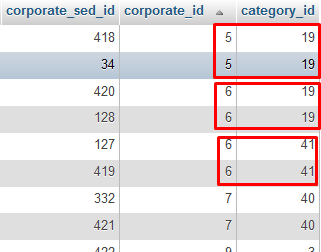

# mysql-tricks

## Query-1: Delete duplicate records based on two columns in MySql



```sql
DELETE
FROM
    corporate
WHERE
    corporate_sed_id IN(
    SELECT
        *
    FROM
        (
        SELECT
            MIN(corporate_sed_id)
        FROM
            corporate
        GROUP BY
            corporate_id,
            category_id
        HAVING
            COUNT(corporate_sed_id) > 1
    ) temp
)
```

## Query-2: Print all database size in MB in MySQL

```sql
SELECT table_schema AS "Database", ROUND(SUM(data_length + index_length) / 1024 / 1024, 2) AS "Size (MB)"FROM information_schema.TABLES GROUP BY table_schema;
```

```shell
+--------------------+-----------+
| Database           | Size (MB) |
+--------------------+-----------+
| drupal             |   1078.69 |
| magento            |  12864.06 |
| pimcore            |   1206.48 |
| website            |    735.73 |
| ecom               |    986.81 |
| information_schema |      0.16 |
+--------------------+-----------+
6 rows in set (57.39 sec)
```
